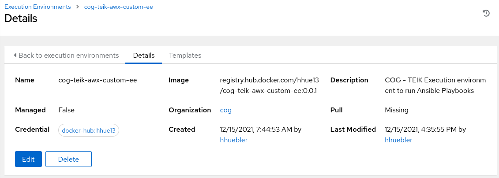

# coe-teik-awx-custom-ee - an AWX execution environment

Source code to create a custom AWX execution environment with customized Python modules and Ansible collections.

## Prepare python3 venv to setup ansible-builder

It is recommended to setup  a virtual python environment to ensure it does not interfere with the local Python environment.

To setup a virtual environment `ansible-builder` run the following commands:

```bash
mkdir -p  ~/venv/ansible-builder
python3 -m venv ~/venv/ansible-builder
source ~/venv/ansible-builder/bin/activate
```

### Install the required modules to build the execution environment

At first startup install some required modules in the venv:

```bash
pip3 install ansible-builder==1.0.1
pip3 uninstall --yes ansible-runner && pip3 install ansible-runner==2.1.3
```

## Clone the git repository whose README.md you are reading

The execution environment is configured via the following files:

- [execution-environment.yml](https://github.com/hhue13/cog-teik-awx-custom-ee/blob/master/execution-environment.yml) - this file contains the execution environment definition with the build instructions for the images being used to create the Dockerfile for the execution environment.
- [requirements.yml](https://github.com/hhue13/cog-teik-awx-custom-ee/blob/master/requirements.yml) - this file lists the **Ansible collections** being installed in the execution environment
- [requirements.txt](https://github.com/hhue13/cog-teik-awx-custom-ee/blob/master/requirements.txt) - this file lists the **Python modules** being installed in the execution environment
- [bindep.txt](https://github.com/hhue13/cog-teik-awx-custom-ee/blob/master/bindep.txt) - This file lists the **rpm packages** being installed in the image
- [ansible.cfg](https://github.com/hhue13/cog-teik-awx-custom-ee/blob/master/ansible.cfg) - This file is *optional* and will be the default **ansible.cfg** for the execution environment

## Build the Docker image with the execution environment

Build the image for the execution environment (**make sure that the proper python env has been activated**) by running:

```bash
ansible-builder build --tag <registry-host>/<registry-library>/<image>:<tag> --context ./context --container-runtime podman
```

for example:

```bash
ansible-builder build --tag localhost/hhue/cog-awx-custom-ee:0.0.1 --context ./context --container-runtime podman
```

## Retag and push the new image

The output of the `ansible-builder` command is a Docker image which is created locally. To use the image in AWX you need to

- Tag the image for the Docker registry you are using
- Push the image to your Docker registry

## Sample execution environment definition in AWX

The following is a sample configuration of the execution environment in AWX:



## Useful links

[https://github.com/ansible/awx](https://github.com/ansible/awx)

[https://github.com/ansible/awx-operator](https://github.com/ansible/awx-operator)

[https://github.com/ansible/awx/blob/devel/INSTALL.md](https://github.com/ansible/awx/blob/devel/INSTALL.md)

[https://github.com/ansible/awx/blob/devel/docs/execution_environments.md](https://github.com/ansible/awx/blob/devel/docs/execution_environments.md)

[https://www.linkedin.com/pulse/creating-custom-ee-awx-phil-griffiths](https://www.linkedin.com/pulse/creating-custom-ee-awx-phil-griffiths)

[https://docs.ansible.com/automation-controller/latest/html/userguide/ee_reference.html](https://docs.ansible.com/automation-controller/latest/html/userguide/ee_reference.html)

[https://weiyentan.github.io/2021/creating-execution-environments/](https://weiyentan.github.io/2021/creating-execution-environments/)
